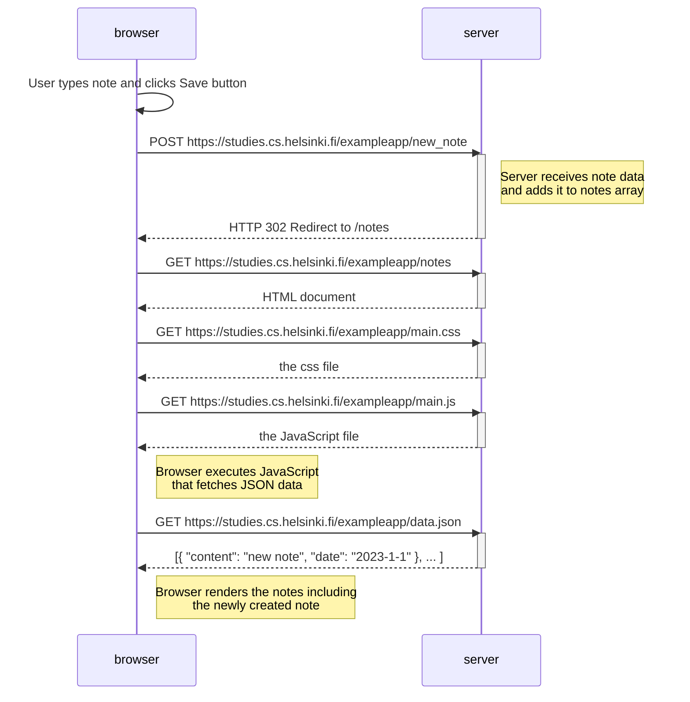

# Exercise 0.4: New note diagram

Sequence diagram depicting creating a new note on the notes page at https://studies.cs.helsinki.fi/exampleapp/notes

```mermaid
sequenceDiagram
    participant browser
    participant server

    browser->>browser: User types note and clicks Save button
    browser->>server: POST https://studies.cs.helsinki.fi/exampleapp/new_note
    activate server
    Note right of server: Server receives note data<br/>and adds it to notes array
    server-->>browser: HTTP 302 Redirect to /notes
    deactivate server

    browser->>server: GET https://studies.cs.helsinki.fi/exampleapp/notes
    activate server
    server-->>browser: HTML document
    deactivate server

    browser->>server: GET https://studies.cs.helsinki.fi/exampleapp/main.css
    activate server
    server-->>browser: the css file
    deactivate server

    browser->>server: GET https://studies.cs.helsinki.fi/exampleapp/main.js
    activate server
    server-->>browser: the JavaScript file
    deactivate server

    Note right of browser: Browser executes JavaScript<br/>that fetches JSON data

    browser->>server: GET https://studies.cs.helsinki.fi/exampleapp/data.json
    activate server
    server-->>browser: [{ "content": "new note", "date": "2023-1-1" }, ... ]
    deactivate server

    Note right of browser: Browser renders the notes including<br/>the newly created note
```
