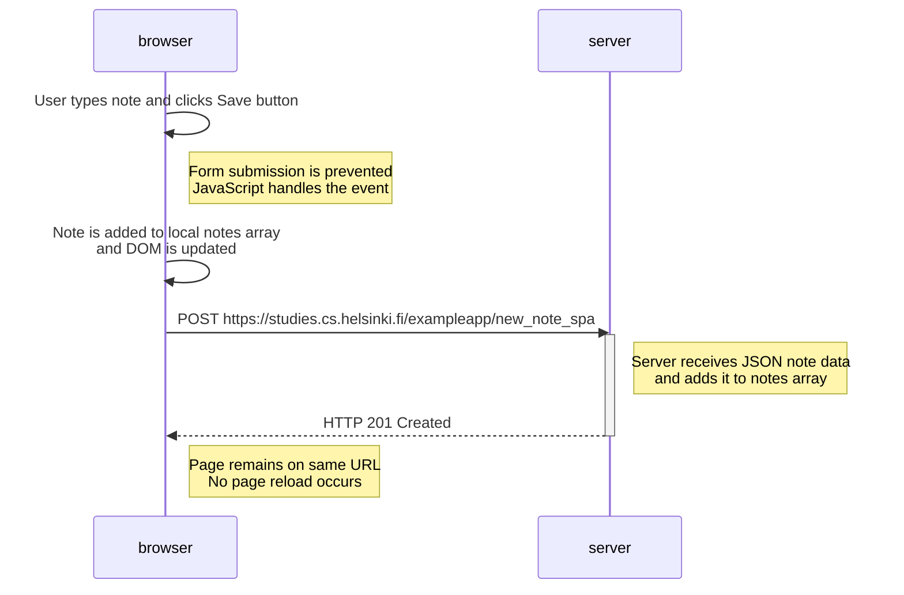

# Exercise 0.6: New note in Single page app diagram

Sequence diagram depicting creating a new note using the single-page version of the app at https://studies.cs.helsinki.fi/exampleapp/spa

```mermaid
sequenceDiagram
    participant browser
    participant server

    browser->>browser: User types note and clicks Save button
    Note right of browser: Form submission is prevented<br/>JavaScript handles the event
    browser->>browser: Note is added to local notes array<br/>and DOM is updated
    browser->>server: POST https://studies.cs.helsinki.fi/exampleapp/new_note_spa
    activate server
    Note right of server: Server receives JSON note data<br/>and adds it to notes array
    server-->>browser: HTTP 201 Created
    deactivate server

    Note right of browser: Page remains on same URL<br/>No page reload occurs
```
